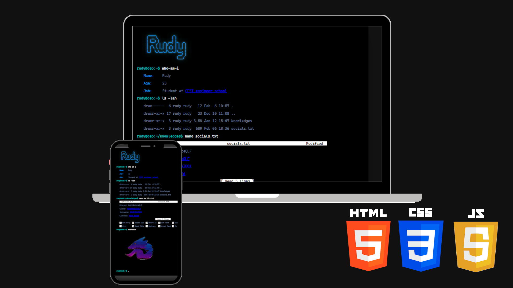

# <h2 align="center">💻 WEB Portfolio LinuxConsole</h2>

<h4 align="center">
  A futuristic Linux terminal inspired portfolio website
  <br/>
  <a href="https://github.com/Rudze/WEB-Portfolio-LinuxConsole" target="_blank">View the project</a>
</h4>

---

<div align="center">
  
</div>

<br/>

<div align="center">

[](https://forthebadge.com)  
[](https://forthebadge.com)  
[](https://forthebadge.com)  
[](https://forthebadge.com)  
[](https://forthebadge.com)  

</div>

---

## 📖 About the Project

**WEB Portfolio LinuxConsole** is a modern portfolio website inspired by Linux terminals and hacker-style interfaces.

The goal of this project is to provide a unique and immersive experience through an interactive console-like UI while showcasing projects, skills, and personal information in a clean and futuristic way.

The website combines:

* 🖥️ Linux terminal inspired design
* ⚡ Smooth animations and transitions
* 📂 Interactive portfolio sections
* 🌌 Modern cyberpunk / hacker aesthetic
* 📱 Responsive design for desktop and mobile
* 🎨 Fully customizable interface

---

## 🚀 Technologies Used

This project was built with:

* HTML5
* CSS3
* JavaScript
* Responsive Design
* Custom UI Animations

---

## 📦 Installation

To install and run the project locally:

### Linux & macOS

```bash
git clone https://github.com/Rudze/WEB-Portfolio-LinuxConsole.git
cd WEB-Portfolio-LinuxConsole
```

### Windows

```bash
git clone https://github.com/Rudze/WEB-Portfolio-LinuxConsole.git
cd WEB-Portfolio-LinuxConsole
```

---

## ▶️ Launch the Project

Simply open the `index.html` file in your browser.

Or use a local server for a better development experience:

```bash
# Example with Python
python -m http.server
```

---

## ✨ Features

* Interactive terminal style interface
* Animated command line effects
* Smooth page navigation
* Fully responsive layout
* Modern developer portfolio structure
* Lightweight and fast loading

---

## 📁 Project Structure

```bash
WEB-Portfolio-LinuxConsole/
│
├── assets/
├── css/
├── js/
├── index.html
└── README.md
```

---

## 🛠️ Customization

You can easily customize:

* Colors and themes
* Terminal commands
* Text and portfolio content
* Animations
* Social links
* Background effects

---

## 📸 Screenshots

<div align="center">
  
</div>

---

## 🤝 Contribution

Contributions, ideas, and improvements are welcome.

Feel free to fork the project and open a pull request.

---

## 📬 Contact

If you want to contact me:

📧 [rudy@galaxynetwork.fr](mailto:rudy@galaxynetwork.fr)

---

## ⭐ Support

If you like this project, don't forget to leave a ⭐ on the repository.

---

## 📄 License

This project is distributed under the MIT License.
